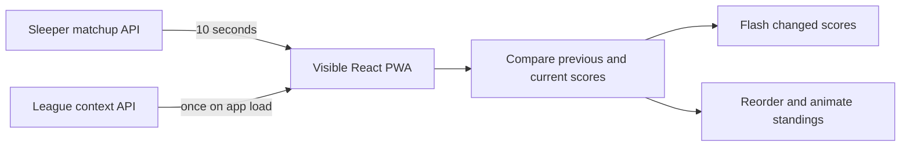
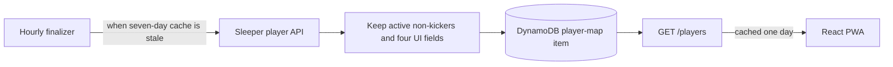
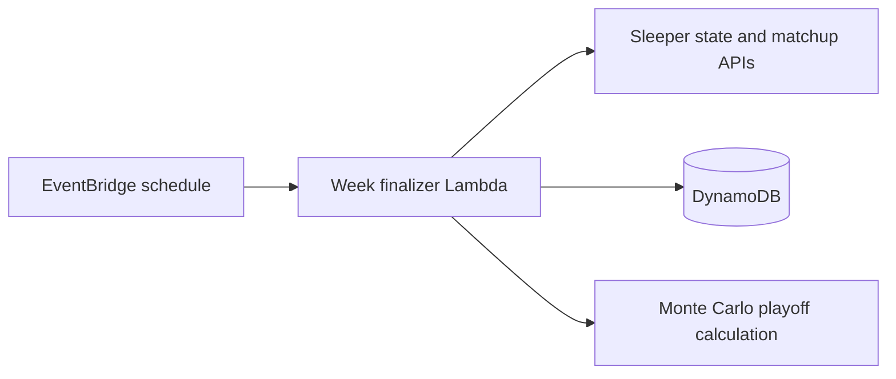

# Architecture plan

## Direction

Keep the React PWA and use Sleeper directly for live, foreground scoring. Use AWS only for durable league data and work that must happen without an open browser.

This approach favors a small system with clear ownership:

- An open PWA polls the current Sleeper matchup and renders live scores.
- The browser detects score changes and animates them locally.
- A scheduled Lambda finalizes completed weeks, refreshes league context, updates overall standings, and runs playoff projections.
- DynamoDB stores finalized results and a compact map of active non-kicker NFL players.
- The existing API serves persisted standings, league context, and the player map to the PWA.

AppSync, DynamoDB Streams, and native iOS development are deferred. They do not provide enough value for the current league size and foreground-only live experience.

## Goals

- Eliminate manual worker startup and weekly maintenance.
- Remove season and league rollover changes from source code.
- Show live score changes and leaderboard movement within a few seconds while the app is open.
- Make finalized weekly and overall standings deterministic and retry-safe.
- Keep AWS usage near zero while the app is idle.
- Avoid downloading Sleeper's full NFL player directory to every device.

## Current architecture

The weekly screen polls Sleeper in the browser and calculates live standings in JavaScript. The backend now contains an hourly week finalizer that persists completed weeks and invokes the Monte Carlo Lambda without an admin action. Conditional records in `ff-league-data` provide leases, completion state, and catch-up after downtime.

The API is read-only: `/league-context`, `/players`, `/weekly`, and `/overall`. The admin prompt, key, mutation routes, polling state, ECS/Fargate task, ECR repository definition, and polling VPC have been removed from the application and CDK template.

The frontend has one coordinated polling stream per current league/week matchup query. It runs every ten seconds only while the page is visible and online; returning to the foreground or reconnecting triggers an immediate refresh. Rosters and users are cached for four hours, projections for fifteen minutes, and the backend player map for one day. Browsers do not request Sleeper's full player directory.

The refactored stack is deployed. Its three retained tables were imported successfully, the frontend uses the new API output, and the unmanaged polling-state table and polling-service ECR repository have been deleted.

## Target data flows

### Live foreground scoring

The repeating poll runs only when:

- The document is visible.
- The selected week is the current week.
- The app is online.

Opening a historical week performs one fetch without starting a repeating poll. Closing or backgrounding the app stops the interval. Returning to the foreground triggers an immediate refresh.

Only the matchup endpoint receives the live interval. Suggested cache behavior for other data:

| Data | Refresh policy |
| --- | --- |
| Current matchup | Every 10 seconds while eligible |
| NFL state | Cached for 5 minutes; refreshed on load or focus when stale |
| Rosters and users | On load, then every few hours |
| Projections | Every 10-15 minutes |
| Compact league player map | On load, cached for one day |
| Full NFL player directory | Backend refresh once per week |

The browser retains the previous matchup result by `roster_id` and `player_id`. A higher score flashes green; any lower score flashes red, whether caused by lost yards, a turnover, or a later stat adjustment. Stable roster IDs allow Motion layout animation when a team's rank changes. Initial, cached, historical, and context-switch data reset the comparison baseline without flashing. Reduced-motion preferences suppress flashing and movement. Vibration is deferred and is not part of this milestone.

### League context and player metadata

The PWA must not access DynamoDB directly. The league-context endpoint returns:

- Active season and week.
- Active Sleeper league ID.
- League status and settings needed by the UI.

The dedicated player endpoint returns a versioned map containing player ID, first name, last name, position, and NFL team. Keeping it separate prevents the five-minute league-context refresh from repeatedly transferring the larger map.

The current Sleeper directory measured about 14.6 MB, while filtering to players assigned to an NFL team, excluding kickers, and retaining four fields produced about 217 KB of compact JSON. The item has a conservative 350 KiB serialized-size ceiling below DynamoDB's 400 KiB item limit. If it reaches that ceiling, split the map across items before expanding the filter or fields.

League IDs change between Sleeper seasons. NFL state supplies the current season and week but does not identify this league. Resolve the current league through a stable configured Sleeper user ID plus an expected league identity, and fail clearly if the lookup finds zero or multiple matches. Do not silently select an arbitrary league.

The map includes active free agents and waiver options, not just players already on fantasy rosters. A player newly assigned to an NFL team may temporarily display a fallback name until the next weekly refresh. The finalizer bootstraps the cache during Week 1, so no completed week or manual player fetch is required. A refresh failure can fall back to a stale map only when its league, season, schema, and contents remain compatible; this keeps completed-week processing moving without allowing missing or obsolete bootstrap data into calculations.

### End-of-week processing

EventBridge invokes a controller on a low-frequency schedule. The controller compares Sleeper's current state with completion records in DynamoDB and processes every missing completed week. When there is no work, it exits after the state check.

For each completed week, the controller:

1. Acquires an idempotency record for `league_id + season + week` with a conditional write.
2. Fetches final matchup data from Sleeper.
3. Runs the canonical vs-everyone calculation.
4. Stores the raw final matchup snapshot and calculated weekly standings.
5. Recalculates overall standings.
6. Runs playoff projections once after the batch of missing weeks is written.
7. Marks the week complete with timestamps and input hashes.

Before writing week data, the finalizer requires the matchup response to contain exactly the league's configured number of unique, known roster IDs. A partial, duplicate, or unknown roster set fails the lease and remains retryable, including during forced correction processing.

Failed work remains retryable. A completion marker is written only after all required writes and playoff projections succeed. A conditional season-wide lease serializes backlog and recovery invocations so separate week batches cannot overwrite overall standings with stale aggregates. Its 20-minute expiry exceeds the Lambda's 15-minute timeout and recovers automatically after a crash without consuming account-wide reserved concurrency. A force-reprocess operation remains available only through an IAM-authenticated direct Lambda invocation, such as `{"force_week": 7}`. It is not exposed through API Gateway.

The finalizer should process only missing or explicitly reprocessed weeks. It should not recalculate the entire season during every scheduled check.

## Sources of truth

| Concern | Source of truth |
| --- | --- |
| Live scores while viewing | Current Sleeper matchup response |
| Live display order | Frontend calculation using the canonical rules |
| Completed weekly standings | DynamoDB output from the finalizer |
| Overall standings and earnings | DynamoDB derived from completed weeks |
| Playoff probabilities | Latest successful Monte Carlo run |
| Current season and NFL week | Sleeper NFL state |
| Current league ID | Validated league resolution from stable league identity |
| Player display metadata | Compact player map in DynamoDB |

The JavaScript and Python standings calculators must share fixture files covering normal rankings, ties, score corrections, zero scores, and reordered input. Both implementations must produce the same records before the backend is treated as canonical for final results.

## AWS resources

The template contains exactly three retained DynamoDB tables, the read API, the finalizer, the Monte Carlo Lambda, shared Lambda layers, and one hourly EventBridge rule. Job state shares `ff-league-data`. There are no container, VPC, polling-state, or public mutation resources.

API Gateway sends both `GET` and `OPTIONS` requests through the read Lambda. The Lambda echoes `Access-Control-Allow-Origin` only for the production site, stable project aliases, and deployment hosts within the app's Vercel team namespace. This supports changing preview deployment names without granting every `vercel.app` site browser access. CORS does not authenticate direct HTTP clients.

The API stage applies a shared five-request-per-second rate limit with a burst capacity of 100 requests. The burst supports concurrent app startup and the chart's historical-week reads; the lower sustained rate limits abuse of the public endpoints. Live matchup polling calls Sleeper directly, so it is unaffected by this throttle.

Hourly scheduling is intentionally simple and cheap. A no-op run resolves Sleeper state and checks player-cache freshness; the full player directory is downloaded only when its seven-day cache is stale. The existing season-wide lease coordinates both refresh and finalization, with freshness rechecked after lease acquisition so concurrent runs do not duplicate the large download. Matchups and league-specific metadata are fetched only when a completed week needs processing.

### Deleted-stack recovery

Recovery is complete. The replacement stack imported `ff-weekly-standings`, `ff-overall-standings`, and `ff-league-data`; Vercel uses its `ApiUrl` output; and the obsolete `ff-polling-state` table and `ff-polling-service` repository were deleted. The first live automatic finalization check remains pending until Sleeper advances from Week 1 to Week 2.

## Delivery plan

### Milestone 0: active league context

Status: implemented. The 2026 league is the permanent lineage seed, and the resolver uses stable member ID `475076051211382784`, the exact league name, and Sleeper's `previous_league_id` chain to validate future renewals.

This is the first implementation slice because all later work depends on the correct season, week, and league ID.

1. Define a typed league-context contract used by the backend and frontend.
2. Resolve season and week from Sleeper NFL state.
3. Resolve the season-specific league ID from a stable user and validated league identity.
4. Add an API endpoint that returns the context.
5. Replace frontend and backend `2025` defaults and fixed league references with the context.
6. Correct the Monte Carlo query that currently reads overall standings from the fixed 2025 partition.
7. Add focused tests for successful resolution, ambiguous matches, missing leagues, and state-fetch failure.

Acceptance criteria:

- A season rollover requires no source-code edit.
- Every query and write carries an explicit season and league ID.
- The application refuses ambiguous league resolution with an actionable error.
- No production code defaults silently to 2025.

### Milestone 1: automated finalization and infrastructure removal

Status: deployed. The unmanaged legacy table and ECR repository are also removed.

1. Convert historical backfill into an idempotent process-missing-weeks operation.
2. Store conditional leases and completion markers in `ff-league-data`.
3. Add hourly EventBridge scheduling and catch-up processing.
4. Refresh required metadata automatically and invoke playoff projections.
5. Keep force-reprocess available only through direct Lambda invocation.
6. Remove the admin system and all ECS, Fargate, ECR, VPC, and polling resources from the template.
7. Preserve the three retained table names and removal policies for import.

### Milestone 2: efficient foreground polling

Status: deployed.

1. Extract the frontend standings calculation into a pure module.
2. Add shared scoring fixtures and make the JavaScript and Python calculators agree.
3. Apply the repeating interval only to current-week matchups.
4. Gate polling on page visibility and network state.
5. Refresh immediately when the page returns to the foreground.
6. Add request-count instrumentation suitable for development verification.

Acceptance criteria:

- One visible client makes at most one repeating Sleeper request per interval.
- No repeating requests occur after the app is closed or while the document is hidden.
- Historical weeks never poll.
- JavaScript and Python return identical standings for the shared fixtures.

### Milestone 3: live visual feedback

Status: deployed.

1. Compare successive matchup snapshots by roster and player ID.
2. Reset the baseline on initial load, cached restore, polling pause, and league/week changes.
3. Flash individual player increases green and all individual player decreases red.
4. Add Motion layout animation for rank changes using stable roster keys.
5. Respect reduced-motion preferences and avoid replaying animations on initial load.
6. Leave phone vibration out of the milestone.

### Milestone 4: compact league player map

Status: deployed.

1. Refresh the full Sleeper player directory in the backend once weekly.
2. Filter it to active players assigned to NFL teams, exclude kickers, and retain only UI fields.
3. Store the compact, versioned map in DynamoDB with a safe item-size ceiling.
4. Return it through a dedicated compressed `/players` endpoint.
5. Remove the full player-directory request from the browser.

### Milestone 5: production validation

Status: infrastructure import, API configuration, legacy-resource removal, and Milestones 2 through 4 are deployed. The settings polish is implemented locally and awaits frontend deployment. The first automatic Week 1 finalization remains pending until Sleeper advances to Week 2.

1. Import the retained tables and deploy the replacement stack.
2. Configure Vercel with the new API output and redeploy the PWA.
3. Verify automatic catch-up and one live weekly transition.
4. Remove the two unmanaged legacy resources after verification.
5. Deploy the Milestone 4 infrastructure, let the hourly finalizer populate `/players`, verify the endpoint, and then deploy the frontend.
6. Add Light, Dark, and System theme preferences and populate “View as” from current Sleeper roster names.

## Deferred options

- AppSync Events and DynamoDB Streams if centralized real-time delivery becomes valuable.
- Web Push for background notifications.
- API Gateway HTTP API migration.
- `uv` for Python dependency locking and deployment bundles.
- Native iOS development. The PWA remains the supported mobile application.

These options should be reconsidered only in response to a concrete need such as background alerts, materially higher user counts, or deployment reliability problems.
