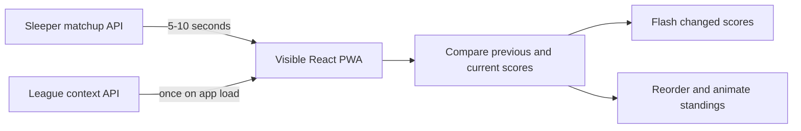
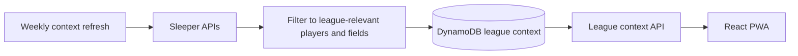
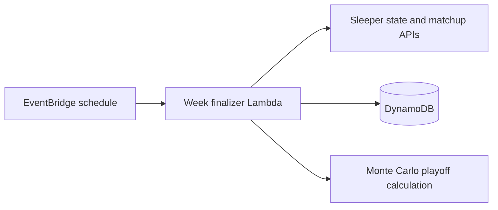

# Architecture plan

## Direction

Keep the React PWA and use Sleeper directly for live, foreground scoring. Use AWS only for durable league data and work that must happen without an open browser.

This approach favors a small system with clear ownership:

- An open PWA polls the current Sleeper matchup and renders live scores.
- The browser detects score changes and animates them locally.
- A scheduled Lambda finalizes completed weeks, refreshes league context, updates overall standings, and runs playoff projections.
- DynamoDB stores finalized results and a compact map of players relevant to the league.
- The existing API serves persisted standings and league context to the PWA.

AppSync, DynamoDB Streams, and native iOS development are deferred. They do not provide enough value for the current league size and foreground-only live experience.

## Goals

- Eliminate manual worker startup and weekly maintenance.
- Remove season and league rollover changes from source code.
- Show live score changes and leaderboard movement within a few seconds while the app is open.
- Make finalized weekly and overall standings deterministic and retry-safe.
- Keep AWS usage near zero while the app is idle.
- Avoid downloading Sleeper's full NFL player directory to every device.

## Current architecture

The weekly screen currently polls Sleeper in the browser and calculates live standings in JavaScript. A manually launched one-off Fargate task separately polls Sleeper and persists another calculation to DynamoDB. The two paths have different tie behavior.

The frontend also applies the live polling interval to matchups, rosters, and projections. Only matchup scores require frequent refreshes. The full player directory is fetched by each browser even though the UI only needs metadata for players relevant to this league.

The backend contains a historical-backfill Lambda and a Monte Carlo Lambda, but both are manually invoked. Before Milestone 0, the application and infrastructure also contained fixed 2025 season values and a season-specific Sleeper league ID.

## Target data flows

### Live foreground scoring

The repeating poll runs only when:

- The document is visible.
- The selected week is the current week.
- The app is online.

Opening a historical week performs one fetch without starting a repeating poll. Closing or backgrounding the app stops the interval. Returning to the foreground triggers an immediate refresh.

Only the matchup endpoint receives the live interval. Suggested cache behavior for other data:

| Data | Refresh policy |
| --- | --- |
| Current matchup | Every 5-10 seconds while eligible |
| NFL state | Every 5 minutes while the app is open |
| Rosters and users | On load, then every few hours |
| Projections | Every 10-15 minutes |
| Compact league player map | On load, cached for one day |
| Full NFL player directory | Backend refresh once per week |

The browser retains the previous matchup result by `roster_id` and `player_id`. A higher score flashes green; a lower score caused by a correction flashes red. Stable roster IDs allow Motion layout animation when a team's rank changes. Reduced-motion preferences must be respected. Vibration remains an optional feature-detected enhancement and is not part of the primary feedback.

### League context and player metadata

The PWA must not access DynamoDB directly. The API returns one compact context response containing:

- Active season and week.
- Active Sleeper league ID.
- League status and settings needed by the UI.
- Roster-to-team-name mappings.
- Player ID, display name, position, and NFL team for players relevant to league rosters.
- A context version and update timestamp.

The compact player map can be stored as one league-season item while it remains safely below DynamoDB's 400 KB item limit. If it approaches that limit, store one item per player and assemble the API response with batched reads.

League IDs change between Sleeper seasons. NFL state supplies the current season and week but does not identify this league. Resolve the current league through a stable configured Sleeper user ID plus an expected league identity, and fail clearly if the lookup finds zero or multiple matches. Do not silently select an arbitrary league.

A newly rostered player missing from the compact map may temporarily display a fallback name. The next context refresh repairs it. The scheduled refresh should run after the league's primary waiver period and can also be invoked manually as a recovery operation.

### End-of-week processing

EventBridge invokes a controller on a low-frequency schedule. The controller compares Sleeper's current state with completion records in DynamoDB and processes every missing completed week. When there is no work, it exits after the state check.

For each completed week, the controller:

1. Acquires an idempotency record for `league_id + season + week` with a conditional write.
2. Fetches final matchup data from Sleeper.
3. Runs the canonical vs-everyone calculation.
4. Stores the raw final matchup snapshot and calculated weekly standings.
5. Recalculates overall standings.
6. Runs playoff projections when the league is in the configured prediction window.
7. Marks the week complete with timestamps and input hashes.

Failed work remains retryable. A completion marker is written only after all required writes succeed. A force-reprocess operation remains available for Sleeper stat corrections or administrative recovery.

The finalizer should process only missing or explicitly reprocessed weeks. It should not recalculate the entire season during every scheduled check.

## Sources of truth

| Concern | Source of truth |
| --- | --- |
| Live scores while viewing | Current Sleeper matchup response |
| Live display order | Frontend calculation using the canonical rules |
| Completed weekly standings | DynamoDB output from the finalizer |
| Overall standings and earnings | DynamoDB derived from completed weeks |
| Playoff probabilities | Latest successful Monte Carlo run |
| Current season and NFL week | Sleeper NFL state |
| Current league ID | Validated league resolution from stable league identity |
| Player display metadata | Compact league context in DynamoDB |

The JavaScript and Python standings calculators must share fixture files covering normal rankings, ties, score corrections, zero scores, and reordered input. Both implementations must produce the same records before the backend is treated as canonical for final results.

## AWS resources after migration

Retain:

- DynamoDB tables for weekly, overall, league-context, and job-state data. Existing tables can be reused where their keys fit the new records.
- API Lambda and API Gateway for league context and persisted standings.
- Historical recovery/finalization Lambda.
- Monte Carlo playoff Lambda.
- EventBridge schedule.
- CloudWatch logs with short retention.

Remove after the scheduled finalizer has completed a production week successfully:

- Fargate polling task.
- ECS cluster.
- Polling ECR repository.
- Polling VPC and security group.
- Polling-state table and admin toggle UI.
- IAM permissions used only to start and stop ECS tasks.

The removal must be a separate deployment after the replacement is verified. DynamoDB resources continue to use retain policies.

## Delivery plan

### Milestone 0: active league context

Status: implemented in the working tree. The 2026 league is the permanent lineage seed, and the resolver uses stable member ID `475076051211382784`, the exact league name, and Sleeper's `previous_league_id` chain to validate future renewals.

This is the first implementation slice because all later work depends on the correct season, week, and league ID.

1. Define a typed league-context contract used by the backend and frontend.
2. Resolve season and week from Sleeper NFL state.
3. Resolve the season-specific league ID from a stable user and validated league identity.
4. Add an API endpoint that returns the context.
5. Replace frontend and backend `2025` defaults and fixed league references with the context.
6. Correct the Monte Carlo query that currently reads overall standings from the fixed 2025 partition.
7. Add focused tests for successful resolution, ambiguous matches, missing leagues, and state-fetch failure.

Acceptance criteria:

- A season rollover requires no source-code edit.
- Every query and write carries an explicit season and league ID.
- The application refuses ambiguous league resolution with an actionable error.
- No production code defaults silently to 2025.

### Milestone 1: efficient foreground polling

1. Extract the frontend standings calculation into a pure module.
2. Add shared scoring fixtures and make the JavaScript and Python calculators agree.
3. Apply the repeating interval only to current-week matchups.
4. Gate polling on page visibility and network state.
5. Refresh immediately when the page returns to the foreground.
6. Add request-count instrumentation suitable for development verification.

Acceptance criteria:

- One visible client makes at most one repeating Sleeper request per interval.
- No repeating requests occur after the app is closed or while the document is hidden.
- Historical weeks never poll.
- JavaScript and Python return identical standings for the shared fixtures.

### Milestone 2: live visual feedback

1. Compare successive matchup snapshots by roster and player ID.
2. Extend the existing score animation hook to handle player and team changes reliably.
3. Flash increases green and corrections red.
4. Add Motion layout animation for rank changes.
5. Respect reduced-motion preferences and avoid replaying animations on initial load.

### Milestone 3: compact league player map

1. Refresh the full Sleeper player directory in the backend once weekly.
2. Filter it to IDs present on league rosters and retain only UI fields.
3. Store the compact, versioned context in DynamoDB.
4. Return it through the league-context endpoint.
5. Remove the full player-directory request from the browser.

### Milestone 4: automated finalization

1. Convert historical backfill into an idempotent process-missing-weeks operation.
2. Add job-state records and conditional acquisition.
3. Add EventBridge scheduling.
4. Invoke playoff projections after a newly finalized week.
5. Keep explicit force-reprocess and recovery paths.
6. Validate one production weekly transition.

### Milestone 5: retire live polling infrastructure

Remove ECS, Fargate, ECR, VPC, polling state, toggle controls, and their permissions after Milestone 4 succeeds in production.

## Deferred options

- AppSync Events and DynamoDB Streams if centralized real-time delivery becomes valuable.
- Web Push for background notifications.
- API Gateway HTTP API migration.
- `uv` for Python dependency locking and deployment bundles.
- Native iOS development. The PWA remains the supported mobile application.

These options should be reconsidered only in response to a concrete need such as background alerts, materially higher user counts, or deployment reliability problems.
